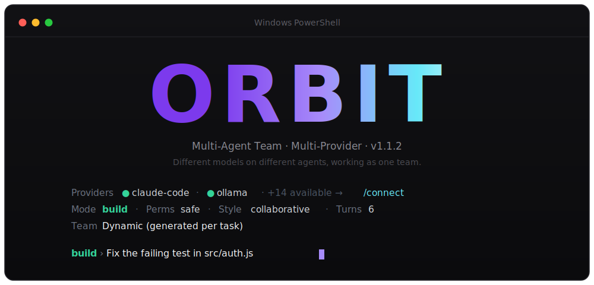

<div align="center">



# Orbit

**A multi-agent, multi-provider AI team in your terminal.**
Put different models on different agents and let them plan, build, review, and communicate as one team — coordinating through a shared task board, channel, and persistent brain.

[](LICENSE)
[](CHANGELOG.md)
[](https://nodejs.org)
[](#providers)
[](#contributing)

[Install](#install) · [Quick start](#quick-start) · [Providers](#providers) · [Modes](#modes) · [How it works](#how-it-works) · [Extending](#extending) · [Contributing](#contributing)

</div>

---

## What is Orbit?

Most AI coding tools are a single model in a loop. Orbit is a **team**. You give it a goal; it designs a small team of specialized agents — each of which can run on a **different provider and model** (a Groq agent planning, a DeepSeek agent coding, a Kimi agent reviewing) — and coordinates them to completion. Everything is a plain `orbit <domain> <action>` command, so humans and spawned CLI agents collaborate through the same shared state.

- 🤝 **Real multi-agent teamwork** — a coordinator routes turns; every agent sees the others' work, builds on it, and signals when the goal is met.
- 🔌 **16 providers, mix-and-match** — Claude Code subscription (no API key), OpenAI, Anthropic, Gemini, NVIDIA, OpenRouter, z.ai, Kimi, Groq, DeepSeek, Together, Mistral, xAI, Fireworks, Ollama, and any custom OpenAI-compatible endpoint.
- 🧠 **Shared state** — a task board, team channel, and a persistent, searchable **brain** (markdown notes), all on disk under `.orbit/`.
- 🛠️ **Two kinds of agents** — Orbit's own in-process provider agents, or **spawned external coding CLIs** (claude / codex / gemini …) that join the team.
- 🧩 **Extensible** — plugins, hooks, skills, and **MCP servers bridged right into the agent tool-loop**.
- 🎛️ **Claude-Code-style TUI** — `chat` / `plan` / `build` modes, a permission toggle, and the whole command surface as slash commands.

---

## Install

<table>
<tr><th>curl (macOS / Linux / Git-Bash)</th><th>PowerShell (Windows)</th></tr>
<tr>
<td>

```bash
curl -fsSL https://raw.githubusercontent.com/shalinda-j/Orbit/main/install.sh | bash
```

</td>
<td>

```powershell
irm https://raw.githubusercontent.com/shalinda-j/Orbit/main/install.ps1 | iex
```

</td>
</tr>
</table>

**npm / bun** (once published): `npm i -g orbit-ai` &nbsp;·&nbsp; `bun i -g orbit-ai`
**Homebrew / AUR:** formula + PKGBUILD in [`packaging/`](packaging/).

**From source:**

```bash
git clone https://github.com/shalinda-j/Orbit && cd Orbit
npm install && npm i -g .    # or `npm link`
```

Then run `orbit init` to write a `.env` template — though if you have **Claude Code** installed and logged in, you need no keys at all.

---

## Quick start

```bash
orbit                 # interactive TUI
orbit connect         # list every provider and how to wire it
orbit run "Build a Python CLI that summarizes Apache access logs"
```

Inside the TUI, type a goal to run the team, or drive the whole system with slash commands:

```text
build › /team join --role PM --cli human
build › /task add "Build auth API" --assignee Backend --priority high --by PM
build › /brain save "Auth Decision" "JWT + refresh tokens, 15m TTL" --tags auth,security
build › Build a REST API for a todo app with tests
```

Or from any terminal:

```bash
orbit task add "Write tests" --depends 1        # shared board with dependencies
orbit msg post "starting auth" --from Backend --mention PM
orbit msg wait --role Backend --timeout 60      # block until pinged
orbit brain search jwt
orbit spawn new --role Backend --cli claude      # bring in an external coding CLI as a teammate
```

---

## Providers

Provide **at least one**. Run `orbit connect` for the live list.

| Kind | Providers | How to connect |
|------|-----------|----------------|
| **Subscription** | Claude Code | Install Claude Code & log in — **no API key**, no per-token cost. Auto-detected & preferred. |
| **Native API** | OpenAI · Anthropic · Gemini · NVIDIA | `OPENAI_API_KEY`, `ANTHROPIC_API_KEY`, `GEMINI_API_KEY`, `NVIDIA_API_KEY` |
| **Presets** (OpenAI-compatible) | OpenRouter · z.ai (GLM) · Kimi · Groq · DeepSeek · Together · Mistral · xAI (Grok) · Fireworks | Just add `<NAME>_API_KEY` — base URL is baked in. Override model with `<NAME>_MODEL`. |
| **Local / custom** | Ollama · any OpenAI-compatible endpoint | Run Ollama locally, or set `CUSTOM_BASE_URL` + `CUSTOM_API_KEY` + `CUSTOM_DEFAULT_MODEL`. |

Because agents are assigned per-provider, **a single run can mix providers** — e.g. plan on Groq, code on DeepSeek, review on Kimi. Add your own with `orbit connect add --name myllm --base-url … --key-env MY_KEY --model …`.

---

## Modes

Like Claude Code, the TUI has modes (shown in the prompt). Cycle with `/mode`, or set directly:

| Mode | Behavior |
|------|----------|
| **chat** | One fast, cheap reply — no team, no synthesis. For quick questions. |
| **plan** | The team produces a plan/design only — read-only, no file writes or commands. |
| **build** | Full multi-agent build. |

`/skip` toggles **permissions** (`safe` read-only ↔ `auto` may write files & run commands) · `/style` toggles collaborative ↔ sequential · `/turns N` sets max turns.

---

## How it works

```
                 ┌─────────────── ./.orbit (shared state) ───────────────┐
   your goal     │  store.json: tasks · messages · roster · findings …    │
       │         │  brain/*.md: persistent knowledge                      │
       ▼         └───────────────────────────────────────────────────────┘
  ┌─────────┐        ▲            ▲                    ▲
  │ Genesis │        │            │                    │
  │ designs │   ┌────┴────┐  ┌────┴────┐          ┌────┴─────┐
  │  a team │──▶│ Planner │  │  Coder  │   …      │ Reviewer │   ← each on its own provider/model
  └─────────┘   │ (Gemini)│  │(DeepSeek)│         │  (Kimi)  │
       │        └────┬────┘  └────┬────┘          └────┬─────┘
       ▼             └──── Coordinator routes turns ───┘
  Synthesizer ◀──── agents see each other's work, use tools, until [FINISHED]
       │
       ▼  final product
```

- **Domains** — every capability is an auto-discovered file in `src/domains/`. Run `orbit help`.
- **Store** — one JSON file under `.orbit/`, mutated under a lock so many processes/agents coordinate safely.
- **Tools** — agents call workspace tools (`view_file`, `write_file`, `run_command`, `list_dir`) and **bridged MCP tools** mid-run; `plan`/`safe` modes block mutations.

### Domains at a glance

`team` · `task` · `msg` · `brain` · `run` · `spawn` · `orchestrate` · `debate` · `finding` · `approval` · `metrics` · `template` · `backup` · `trigger` · `dashboard` · `github` · `gitlab` · `mcp` · `skill` · `plugin` · `hook` · `connect` · `config`

---

## Extending

Orbit is configured through `./.orbit/config.json` (plus a global `~/.orbit/config.json`).

- **Plugins** — `orbit plugin add ./my-plugin.js`. A plugin exports `register(api)` and can `addProvider`, `addDomain`, `addHook`, `addSkill`. See [`examples/orbit-plugin-example.js`](examples/orbit-plugin-example.js) and [`plugins/git-api.js`](plugins/git-api.js) (raw GitHub/GitLab REST via token).
- **MCP servers** — `orbit mcp add --name fs --command npx --args "-y,@modelcontextprotocol/server-filesystem,."`. Configured servers' tools are **auto-discovered and offered to agents during a run** — an agent calls one with `<tool:mcp server="fs" name="read_file">{"path":"README.md"}</tool:mcp>`.
- **Hooks** — `orbit hook add --on run.after --run "notify-send done"` (events: `session.start`, `run.before`, `run.after`).
- **Skills** — reusable instruction snippets: `orbit skill new review "You are a strict reviewer…"`, then `orbit skill run review "<diff>"`.

---

## Development

```bash
npm test        # 8 test suites, all offline (providers mocked) — no network, no keys
```

---

## Contributing

Contributions are welcome. Open an issue to discuss a change, or send a PR:

1. Fork and branch from `main`.
2. Keep it dependency-light and cross-platform (Windows included); match the existing style.
3. Add or update a test in `tests/` and make sure `npm test` is green.

---

## License

[MIT](LICENSE) © Shalinda Jayasinghe

<div align="center"><sub>Built with a multi-agent team. Bugs found and fixed by an adversarial audit — see the <a href="CHANGELOG.md">changelog</a>.</sub></div>
